# Acraea-Prototype 

a Small Scale Solar Desalination and Water Purification Prototype. Is powered by electric
heating for scientific purpose and prototyping ahead according to the Libre Water Mission:  
"Providing Free and Open Source Hardware Designs for Solar-thermal Desalination that can be manufactured and innovated locally in Makerspaces across the world"

## License
Hardware is licensed under a [CERN-OHL-S v2 license](https://ohwr.org/cern_ohl_s_v2.txt)

Documentation is licensed under a [Creative Commons Attribution-ShareAlike 4.0 International License](https://creativecommons.org/licenses/by-sa/4.0/)  
This applies to all design files (CAD, BOM, etc.)

## Disclaimer

THE DESIGN IS PROVIDED "AS IS", WITHOUT WARRANTY OF ANY KIND, EXPRESS OR
IMPLIED, INCLUDING BUT NOT LIMITED TO THE WARRANTIES OF MERCHANTABILITY,
FITNESS FOR A PARTICULAR PURPOSE AND NONINFRINGEMENT. IN NO EVENT SHALL THE AUTHORS OR RIGHT HOLDERS BE LIABLE FOR ANY CLAIM, DAMAGES OR OTHER
LIABILITY, WHETHER IN AN ACTION OF CONTRACT, TORT OR OTHERWISE, ARISING FROM, OUT OF OR IN CONNECTION WITH THE DESIGN OR THE USE OR OTHER DEALINGS IN THE DESIGN.

## Acraea - Short Info:

### Acraea is:  
(X) a [fresh water Nymph](https://en.wikipedia.org/wiki/Acraea) from ancient Greek mythology.  
(X) a Small Scale Desalination and Water Purification Prototype that is powered by electric   heating and has a built-in energy recovery using four stages.  
(—) patented  
(X) [free (as in freedom) - so anyone can study, modify, distribute, make, and sell the design](https://www.oshwa.org/definition/)

###  Version 2.0 of Acraea is:
(X) able to produce a limited amount of pure water from almost any water source  
(X) a Modular Design compatible for adaptation to solar-thermal and other heat sources  
(X) a Circular Design compatible for flexible mid-term design evolution  
(X) Compatible for modular scale-up 

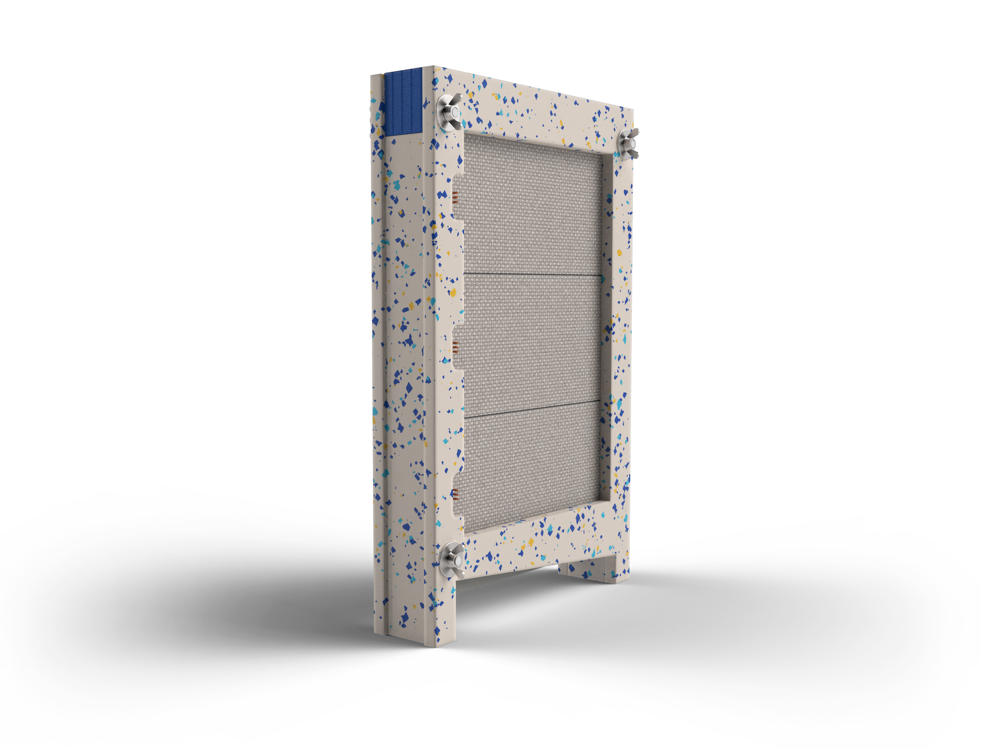

<b>Img.01:</b> Render of assembled Prototype

 

## Project Context:   

### This design is part of the Prototyping for LibreWater.

**Mission of LibreWater:**  Providing Free and Open Source Hardware Designs for Solar-thermal Desalination that can be manufactured and innovated locally in Makerspaces across the world  
**Currently hosted by:**  Blue Greece - an Open Source Hardware Developer Collective  
**Owned by:** Turtles  
  

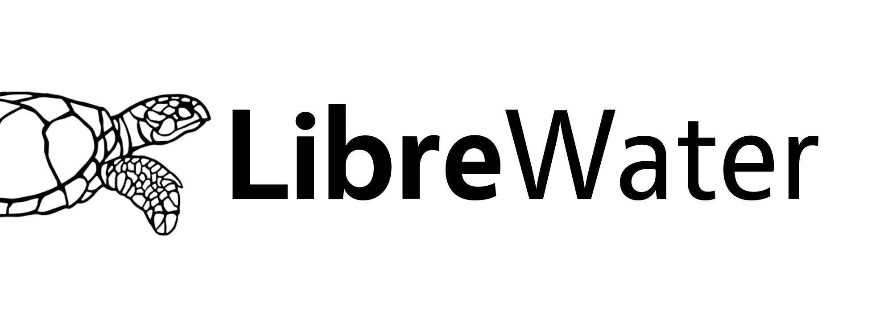

<b>Img.02:</b> Libre Water Logo

  

  
### Here is a short intro video on Libre Water from a design contest in January 2023:

<a href="https://www.youtube.com/watch?v=Ojm_Nrax2sg" target="_blank">
  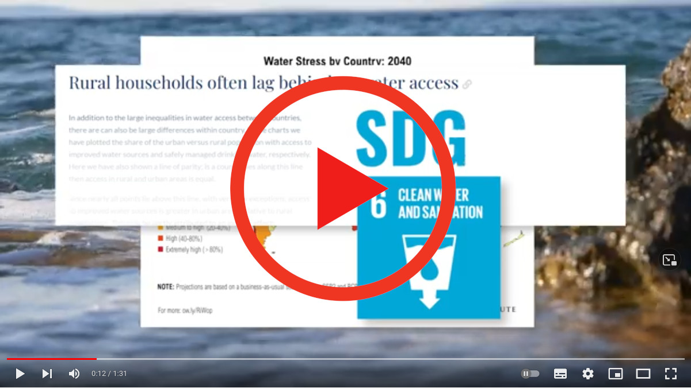
</a>

## Core Technology: Vertical Multiple-Effect-Distillation  
The [process of the rain](https://upload.wikimedia.org/wikipedia/commons/b/b1/Diagram_of_the_Water_Cycle.jpg) in a box with integrated energy recovery.

Water is evaporated to clean steam and condensed again on an array of metal plates:
Creating highly pure water from almost any water source without the need for special filters.  #nofilter  
The heat from the condensation process is recovered (Img.04) and heating the next saltwater film for evaporation. 

Check out a short video of the running module here: 

<a href="https://youtu.be/kDWv2w7YqlU" target="_blank">
  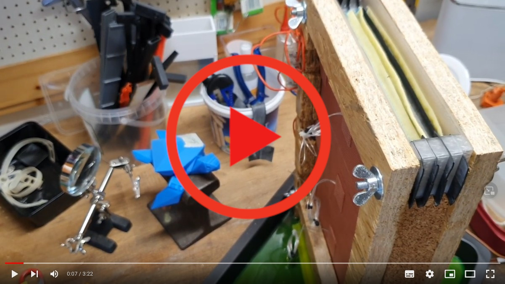
</a>

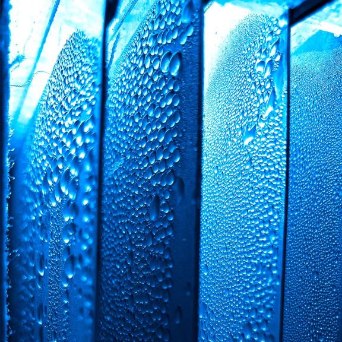

<b>Img.03:</b> Acraea 2.0 Running with removed sidewall. Heating plate on left corner of the photograph. Drops are growing from the condensation of pure steam.

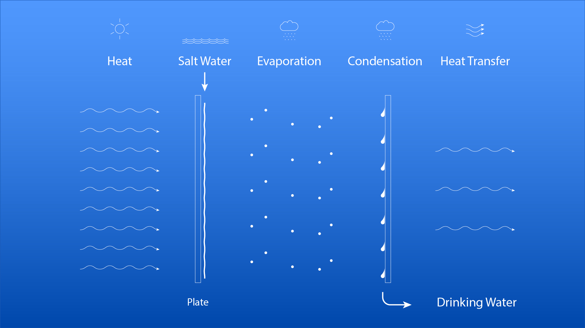

 

 

<b>Img.04:</b> Process Schematics: The heat from condensation of fresh water is transferred ot the next stage

 

## Use-Cases: What is this prototype good for:

**Makerspace Co-Creation:**
- Decentralized collaboration on design
- Accessible and fast iterations in early stage

**Research:**
- accessible setup for the functioning principle of Multiple-Effect-Distillation
- experimenting with heat transfer across plates and stages
- experimenting with fluid dynamics with different wicks or wick-free structures
- study behaviour of alternative materials & biomaterials

**Education**
- simple production and assembly
- high responsiveness: fast start-up time
- uniting a broad field of disciplines: 3D Printing, CNC Milling, Sewing, Coding, Electronics
- familiarizing with Open Source Collaboration

## Modular Design Approach

Acraea has been designed with circularity and modularity in mind. 
For the full part overview with more details check out the [Bill-Of-Materials](bom.pdf).
For following our design choices and bringing in your own ideas, please check out DesignPath.pdf (soon)

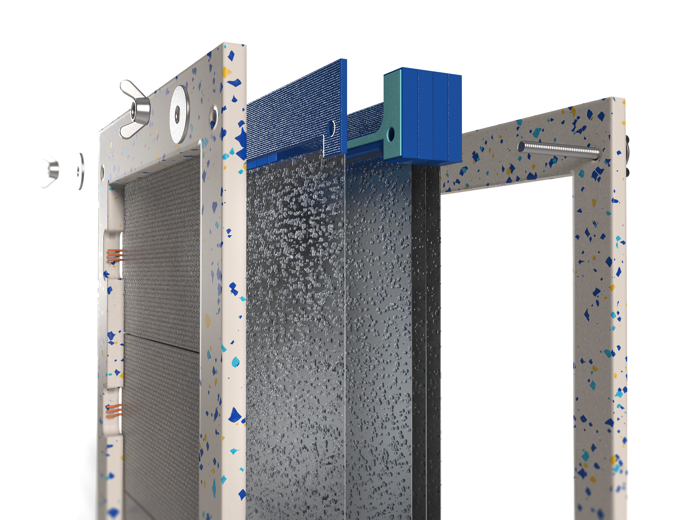

 

<b>Img.05</b>: Render: Explosion View

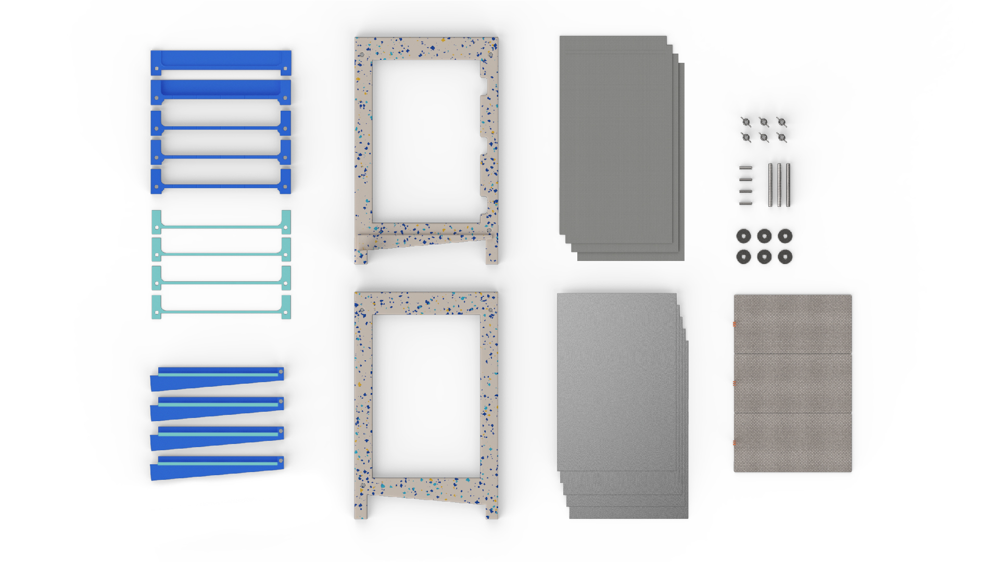

 

<b>Img.06:</b> Render: Top view of components

 

**Module: Casing**
- CNC-Machined Plywood

**Module: Plates**
- Plate size: 300 mm x 200 mm x 0,5 mm
- Plate Material: Aluminum

**Module: Heating**
- Electric: 24V IPX7 Silicon Patches (note: currently still proprietary)
 
**Module: Fluid System** 
- Feed: FDM-Printed PETG 
- Drainage: FDM-Printed PETG 
- Sealing feed: Bicycle tube 

## Manufacturing: Required tools & machinery 
- 3D Printer (25 cm build size, e.g. Prusa i3)
- Sewing machine
- Jigsaw or CNC Mill
- basic workshop equipment 

Please mind the time it takes to 3D-Print the PETG Parts: one drainage can take about 3 hours, the parts of the tank all together also 6 hours.

## Assembly
We are working on different approaches for assembly instructions. We found the approach of OSH-AUTODOC to be most meaningful and would be happy to hear your feedback. Generally, we also provide How-To Videos on major releases.

### Assembly Manual
Follow the [Assembly Manual](https://codeberg.org/LibreWater/Acraea-Prototype/src/branch/main/doc/assembly/Acraea-2-0-assembly-manaual.pdf) for Step-by-step instructions. 
They were created with kind support of OSH-AUTODOC & JC.  
[OSH-AUTODOC](https://codeberg.org/osh-autodoc) is a FreeCAD Add-On under development to (semi) automatically generate documentation for Open Source Hardware.  
For more details, please contact JC or Pieter.  

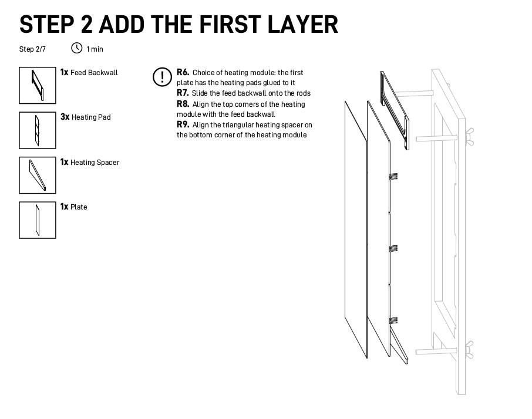

 

<b>Img.07:</b> Example of OSH-Autodoc generated assembly manual

 

### Videos

Stay tuned, we are revising the video-assembly with the latest design update and will share it briefly. If you would like to engage and have ideas how to make clear and fun tutorials - please reach out to us on librewater@posteo.net. 

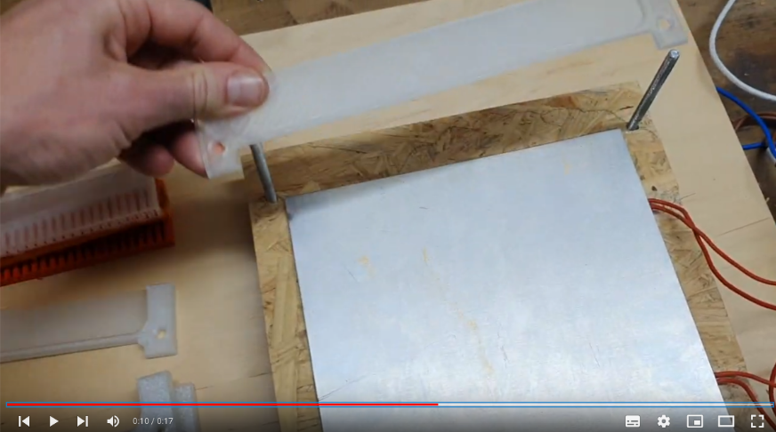

 

<b>Img.08:</b> Screenshot of How-To Assembly Video

### Process Control

**Heat input**
The current approach is to have a constant power input of P = 150 W. This is done by adjusting the On- and Off-switching times by an Arduino or ESP32 controlled relay, connected to a 24 V power supply which is powering three 24 V heating pads on the first stage. 

-> Check out the Wiring.pdf for  the setup and the code under TurtleHeat_v3.ino

**Feed water input**
The water level (hydrostatic pressure) in the tank regulates the inflow of the non-drinkable water. Filling it up to 2 cm creates maximum feed flow rate. 
Testing & Validation   
Vertical Multiple-Effect-Distillation is a simple process:
Quality and safety can be tested by electric conductivity with a TDS sensor.
Performance can be assessed by knowing the electric heat input relative to the water output

-> For more details, check out our Testing.md (draft stage) 

## Research: Acraea for Open Science

Over the past 60 years, countless scientists and a few entrepreneurs have worked on Solar-Powered Multiple-Effect-Distillation.   One of the most recent reviews is from January 2022 by Lim et al. from Korea Institute of Machinery & Materials:   [Designs and performance analysis of vertical multi-effect diffusion solar distiller: A review - ScienceDirect  (OpenAccess)](https://www.sciencedirect.com/science/article/pii/S0011916422000273)

-> Check out selected sources and more info in the Science Folder (soon).

## Ideas for next Iterations:  
(   ) Electric heating system: replace with locally producable alternative  
(   ) Adding a tank for longer operation  
(   ) Increase energy efficiency by adding more stages  
(   ) Testing an improved Wick design  
(   ) Testing Wick-Free designs  
(   ) Scaling Up  
(   ) Adding insulation  
(   ) Adding Solar-Thermal Heating Module  

-> Find our considerations in DesignPath.md (soon) to follow the path behind our sometimes mad-scientific and sometimes random decisions and bring in your own ideas - we appreciate all of them.

## Contact
Would you like to flow along? Do you have any questions, ideas or general feedback?

For any inquiries, suggestions, collaborations or just spreading your love, you may reach us at librewater@posteo.net

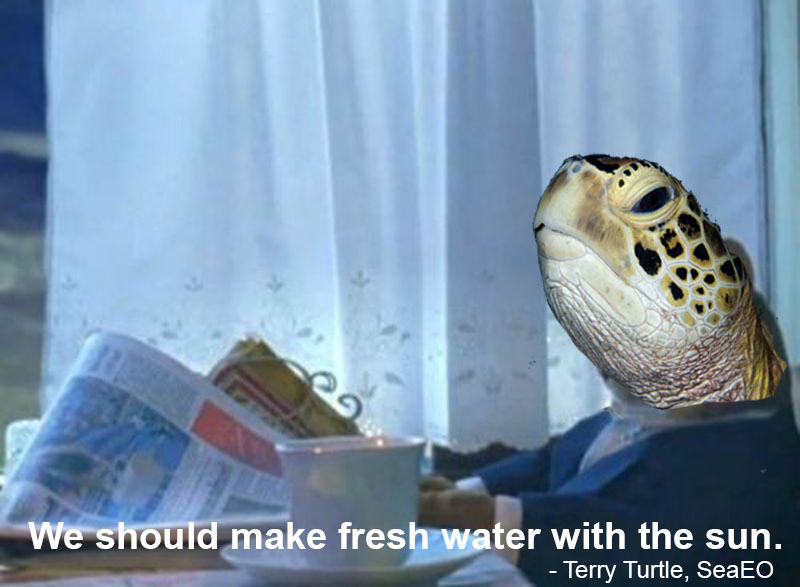

 

<b>Img.09:</b> Invitation from the SeaEO of LibreWater

 

## Inspiration from Science and 
We kindly thank Michael for his [Solar Pura](https://www.appropedia.org/Solar_Pura:_High-efficiency_vertical_solar_still) work on solar MED and Florian for his [MED Prototype](https://github.com/fsteckel/OpenWater). Furthermore, we like to acknowledge the contributions on VMED by [countless dedicated researchers over the past decades](https://www.sciencedirect.com/science/article/pii/S0011916422000273) and thank companies from the field for sharing their experiences.

## Contributions from Individuals
The list of contributors and supporters is endless. What would be an appropriate way to mention all of them? Is it meaningful to do so? We are still thinking about how to give credit and also give back in the best way. 
One thing is for sure: Without the support of countless kind people from all over the world, we would never have gone on this adventure. You know who you are. It has been most importantly your ideas, your feedback, our sharing of time - often a little, sometimes a lot that has made this project a reality. This is the magic of Open Source Hardware, the magic of people joining together with collective intelligence. 

## Support from Institutions and Spaces
In the early stage of Blue Greece  <b>
(we started with a different Mission: Reducing plastic waste by creating community-powered social beverages to Greek Islands)  
- [Bodossaki Foundation Social Dynamo](https://www.socialdynamo.gr/en/social-dynamo/) (Athens)    
- [Helidoni Foundation](https://helidonifoundation.org/) (Athens)  

In the Open Source Hardware stage:  
- [MIT Water Innovation Prize Semifinals](http://www.mitwaterinnovation.org/) (global)    
- [Open Hardware Makers](https://openhardware.space/) (global)  
- [Fab City Hamburg](https://www.fabcity.hamburg) (Hamburg)  
- [Prototype Fund Hardware](https://hardware.prototypefund.de/) (Berlin)  
- [Fabulous St.Pauli](https://www.fablab-hamburg.org/) (Hamburg)  
- [Curious Community Labs](https://curious.bio/) (Hamburg)  
- [Odyssea](https://odyssea.com) (Athens)  
- [Hackerspace.gr](https://www.hackerspace.gr) (Athens)  

## Safety Disclaimer

This design has not been tested extensively. It has to be regarded as not yet suitable for:
- production of water for any other case other than scientific research 
- Operation without supervision by a skilled operator 
- Use in external environment

Please be aware that building a water machine can be dangerous and requires full awareness of the risks involved. Blue Greece/Libre Water does not warrant for any contents of the manual and does not assume any risks whatsoever with regard to the contents of this manual or the machine assembled by you. Blue Greece/Libre Water further does not warrant for and does not assume any risks whatsoever with regard to any parts of the machine contained in this manual which are provided by third parties. You need to have the necessary experience in handling the machinery required to build the machine described in this manual. Otherwise you should seek professional advice for building the machine.
